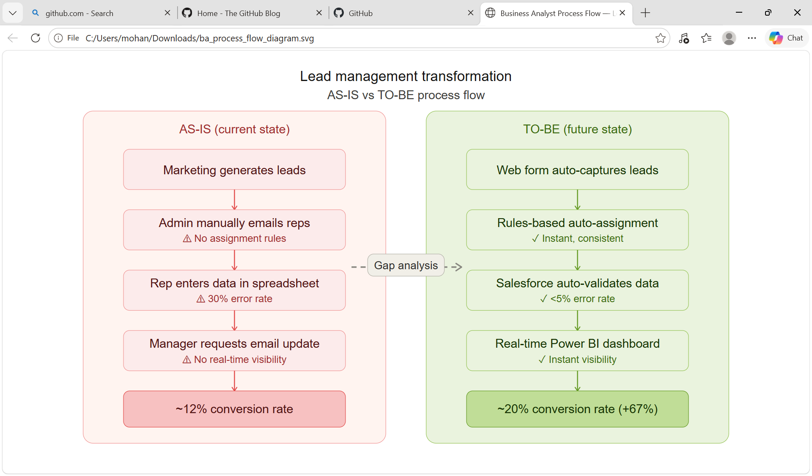
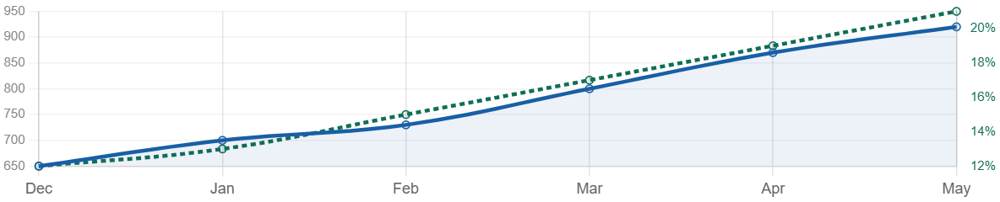

# Hi, I'm Mohan Sarath 👋

### Senior Business Analyst | Banking & Financial Services | Toronto, ON

I'm a results-driven Senior Business Analyst with 5+ years of experience delivering technology and data solutions across **Banking, Financial Services, Insurance, and E-commerce** domains.

I use this space to share BA templates, SQL samples, and process documentation that reflect real-world project work.

---

## 🧠 What I Do

- **Requirements Engineering** — BRDs, FRDs, User Stories, Use Cases
- **Data Analysis** — SQL queries, data validation, data mapping
- **Process Design** — AS-IS / TO-BE modeling, gap analysis, workflow optimization
- **Agile Delivery** — Sprint planning, backlog grooming, UAT coordination
- **Stakeholder Management** — JAD sessions, workshops, cross-functional collaboration
- **Salesforce** — Sales Cloud, Service Cloud, workflow automation
- **Reporting & BI** — SSRS, Crystal Reports, Power BI

---

## 🏦 Industries & Domains

| Domain | Companies |
|---|---|
| Banking & Financial Services | Home Equity Bank, Citi Group, Capital One |
| Insurance | The Great-West Life Assurance Company |
| Pharma / ERP | AbbVie |

---

## 🛠️ Tools & Technologies

| Category | Tools |
|---|---|
| Data & Reporting | SQL, SSRS, Crystal Reports, Power BI, Excel |
| CRM | Salesforce (Sales & Service Cloud) |
| Methodology | Agile/Scrum, Waterfall, RUP |
| Documentation | MS Visio, Confluence, JIRA, SharePoint |
| Diagramming | UML, DFD, ER Diagrams, Activity Diagrams |
| Project Tools | MS Project, MS Office Suite |

---

## 📊 Process Flow

## 📈 Dashboard

## 📁 Repository Guide

| Repository | Description |
|---|---|
| [BRD_Template.md](./BRD_Template.md) | Business Requirements Document template |
| [UAT_Test_Plan_Template.md](./UAT_Test_Plan_Template.md) | UAT test plan & test cases |
| [User_Story_Templates.md](./User_Story_Templates.md) | Epic, User Story & Sprint templates |
| [BA_SQL_Queries.sql](./BA_SQL_Queries.sql) | Real-world SQL queries for data analysis |
| [AS_IS_TO_BE_Analysis.md](./AS_IS_TO_BE_Analysis.md) | AS-IS / TO-BE process flow & gap analysis |

---

## 📊 GitHub Stats

---

## 🤝 Let's Connect

---

> *"Good analysis is not about having the right answers — it's about asking the right questions."*
